# AI Build Operating System

A repo-native, agent-compatible operating model for building software from idea to completion.

---

## What This Is

The AI Build OS is a repeatable process framework stored as files in your repository. It defines **how** you build software — whether you're working alone, with an AI coding agent, or both.

It gives you:

- A **9-stage workflow** from idea capture through handoff
- **Fill-in templates** that produce predictable artifacts at each stage
- A **project memory** system so you never redo work unnecessarily
- An **agent contract** (AGENTS.md) so AI tools know how to behave
- A **next-action tracker** (STATUS.md) so both you and your agent always know what to do next

This is not an app. It is the system you use to build apps.

---

## Core Principles

| Principle | What It Means |
|---|---|
| **Repo-native** | Everything lives as files in your repo — no external tools required |
| **Agent-compatible** | Any AI coding agent can read the files and know what to do |
| **Predictable artifacts** | Every stage produces the same kind of output every time |
| **Memory-preserving** | Decisions, patterns, and progress persist across sessions |
| **Next-action obvious** | STATUS.md always tells you (or the agent) what happens next |
| **Simple and durable** | Plain markdown — no fragile tooling, no lock-in |

---

## The 9-Stage Lifecycle

```mermaid
flowchart LR
    S1["1. Idea\nCapture"] --> S2["2. Clarifi-\ncation"]
    S2 --> S3["3. Specifi-\ncation"]
    S3 --> S4["4. Technical\nPlan"]
    S4 --> S5["5. Task\nBreakdown"]
    S5 --> S6["6. Implemen-\ntation"]
    S6 --> S7["7. Review &\nValidation"]
    S7 --> S8["8. Documen-\ntation"]
    S8 --> S9["9. Handoff"]

    S7 -.->|"issues found"| S6
    S2 -.->|"scope change"| S1

    style S1 fill:#4a90d9,color:#fff
    style S2 fill:#4a90d9,color:#fff
    style S3 fill:#7b68ee,color:#fff
    style S4 fill:#7b68ee,color:#fff
    style S5 fill:#e67e22,color:#fff
    style S6 fill:#e67e22,color:#fff
    style S7 fill:#27ae60,color:#fff
    style S8 fill:#27ae60,color:#fff
    style S9 fill:#2c3e50,color:#fff
```



| Stage | Purpose | Key Output |
|---|---|---|
| **1. Idea Capture** | Record the raw idea and motivation | `01-idea.md` |
| **2. Clarification** | Fill gaps, resolve ambiguity | `02-clarification.md` |
| **3. Specification** | Define what to build precisely | `03-spec.md` |
| **4. Technical Plan** | Design how to build it | `04-plan.md` |
| **5. Task Breakdown** | Split work into small, reviewable tasks | `05-tasks.md` |
| **6. Implementation** | Build it, following the plan | `06-implementation-log.md` |
| **7. Review & Validation** | Verify it works correctly | `07-review.md` |
| **8. Documentation** | Record what was built and learned | `08-report.md` |
| **9. Handoff** | Prepare for next session or next person | `09-handoff.md` |

Full stage definitions: [`workflow/`](workflow/00-overview.md)

---

## Quick Start: New Project

### 1. Create a project folder

```
mkdir projects/my-project
```

### 2. Copy the status tracker

```
cp project-starter/STATUS.md projects/my-project/STATUS.md
```

### 3. Start with Stage 1

Copy `templates/idea-intake.md` into your project folder as `01-idea.md` and fill it in.

### 4. Follow the stages

Each stage's definition tells you:
- What inputs you need
- What questions to answer
- What artifact to create
- When you're done and what's next

### 5. Update STATUS.md as you go

Keep your `STATUS.md` current — it's how you (and any AI agent) know what to do next.

Full starter guide: [`project-starter/README.md`](project-starter/README.md)

---

## Folder Structure

```
ai-build-os/
├── README.md               ← You are here
├── AGENTS.md               ← Rules for AI coding agents
├── workflow/               ← Stage definitions (the process)
├── templates/              ← Fill-in templates (the artifacts)
├── memory/                 ← Decisions, patterns, project index
├── diagrams/               ← Mermaid diagrams of the system
├── project-starter/        ← Tools for starting a new project
└── examples/               ← Worked example (bookmark-cli)
```

| Folder | When To Use It |
|---|---|
| `workflow/` | When you need to understand what a stage requires |
| `templates/` | When you need to create an artifact for a stage |
| `memory/` | When you need to check past decisions, patterns, or project status |
| `project-starter/` | When you're starting a new project |
| `examples/` | When you want to see how the system works in practice |

---

## For AI Agents

If you are an AI coding agent working in a project that uses the AI Build OS:

1. **Read [`AGENTS.md`](AGENTS.md)** first — it defines your operating contract
2. **Read the project's `STATUS.md`** — it tells you what stage you're in and what to do next
3. **Follow the workflow stage** you're in — each stage file tells you what's expected
4. **Use the templates** — they ensure consistent, predictable output
5. **Update memory** — log decisions and record patterns when you learn something reusable

---

## Evolving This System

This system is designed to improve over time:

- **Add new templates** when you find yourself creating the same kind of document repeatedly
- **Add new patterns** to `memory/patterns.md` when you discover reusable solutions
- **Refine stage definitions** as you learn what works in practice
- **Add new examples** as you complete projects

The system should grow through use, not through upfront design.

---

## See It In Action

The [`examples/bookmark-cli/`](examples/bookmark-cli/STATUS.md) folder contains a fully worked example showing every stage and artifact for a fictional CLI Bookmark Manager project.
