# Artifact Map

How workflow stages, templates, project artifacts, and memory relate to each other.

```mermaid
flowchart TD
    subgraph WORKFLOW["📋 Workflow Stages"]
        W1["01-idea-capture"]
        W2["02-clarification"]
        W3["03-specification"]
        W4["04-technical-plan"]
        W5["05-task-breakdown"]
        W6["06-implementation"]
        W7["07-review"]
        W8["08-documentation"]
        W9["09-handoff"]
    end

    subgraph TEMPLATES["📄 Templates"]
        T1["idea-intake.md"]
        T2["clarification.md"]
        T3["spec.md"]
        T4["implementation-plan.md"]
        T5["task.md"]
        T6["impl-log-entry.md"]
        T7["review-checklist.md"]
        T8["post-task-report.md"]
        T9["session-handoff.md"]
        TD["decision-log-entry.md"]
        TP["patterns-and-lessons.md"]
    end

    subgraph ARTIFACTS["📁 Project Artifacts"]
        A1["01-idea.md"]
        A2["02-clarification.md"]
        A3["03-spec.md"]
        A4["04-plan.md"]
        A5["05-tasks.md"]
        A6["06-impl-log.md"]
        A7["07-review.md"]
        A8["08-report.md"]
        A9["09-handoff.md"]
        AD["decisions.md"]
        AS["STATUS.md"]
    end

    subgraph MEMORY["🧠 Project Memory"]
        MD["memory/decisions.md"]
        MP["memory/patterns.md"]
        MI["memory/project-index.md"]
    end

    W1 -->|"uses"| T1
    W2 -->|"uses"| T2
    W3 -->|"uses"| T3
    W4 -->|"uses"| T4
    W5 -->|"uses"| T5
    W6 -->|"uses"| T6
    W7 -->|"uses"| T7
    W8 -->|"uses"| T8
    W9 -->|"uses"| T9

    T1 -->|"produces"| A1
    T2 -->|"produces"| A2
    T3 -->|"produces"| A3
    T4 -->|"produces"| A4
    T5 -->|"produces"| A5
    T6 -->|"produces"| A6
    T7 -->|"produces"| A7
    T8 -->|"produces"| A8
    T9 -->|"produces"| A9
    TD -->|"produces"| AD

    AD -.->|"feeds into"| MD
    A8 -.->|"feeds into"| MP
    A8 -.->|"feeds into"| MI

    AS -.->|"tracks progress\nacross all stages"| ARTIFACTS

    style WORKFLOW fill:#e8f0fe,stroke:#4a90d9
    style TEMPLATES fill:#f3e8ff,stroke:#7b68ee
    style ARTIFACTS fill:#fff3e0,stroke:#e67e22
    style MEMORY fill:#e8f5e9,stroke:#27ae60
```

## Reading the Diagram

| Relationship | Meaning |
|---|---|
| **Stage → Template** | Each workflow stage uses a specific template |
| **Template → Artifact** | Each template produces a project artifact when filled in |
| **Artifact → Memory** | Decisions and patterns from artifacts feed into project memory |
| **STATUS.md → Artifacts** | STATUS.md tracks which artifacts have been completed |

## Key Insight

The system has three layers:
1. **Process** (workflow stages) — defines *what to do*
2. **Structure** (templates) — defines *how to do it*
3. **Knowledge** (memory) — preserves *what was learned*

Project artifacts sit at the intersection — they're the concrete output of applying templates within a workflow stage, and they feed the memory system that makes future projects better.
