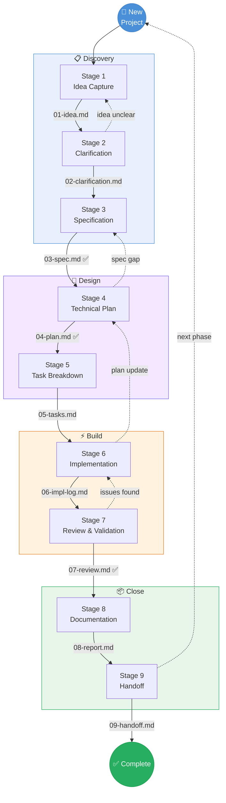

# Workflow Lifecycle Diagram

The complete 9-stage workflow with decision points, feedback loops, and artifact outputs.

## Reading the Diagram

- **Solid arrows** → Normal forward flow with the artifact name produced at each stage
- **Dashed arrows** → Feedback loops when issues are discovered
- **✅ marks** → Stages where human approval is required before proceeding
- **Subgroups** → The four phases: Discovery, Design, Build, Close
- **"next phase" loop** → When a project hands off to a follow-up phase, it starts a new project at Stage 1
