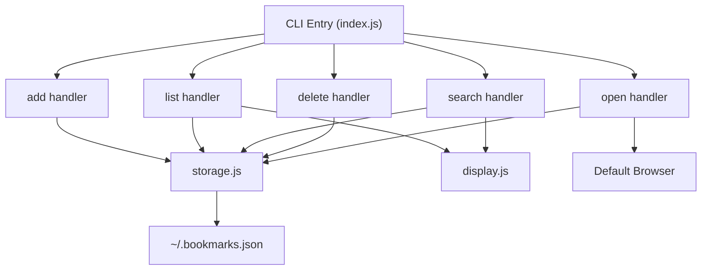

# Implementation Plan

## Metadata

| Field | Value |
|---|---|
| **Project** | Bookmark CLI |
| **Date** | 2026-03-29 |
| **Author** | Agent |
| **Stage** | 4 — Technical Plan |
| **Status** | Approved |
| **Spec Reference** | `03-spec.md` |

---

## Overview

Build a Node.js CLI application using Commander.js for command parsing and a local JSON file for persistent storage. The architecture is simple: a single entry point dispatches to command handlers, which operate through a shared storage module.

---

## Architecture

### Components

| Component | Responsibility | Technology |
|---|---|---|
| CLI Entry Point | Parse commands, dispatch to handlers | Commander.js |
| Command Handlers | Business logic for each command | Plain Node.js |
| Storage Module | Read/write bookmarks to JSON file | Node.js fs module |
| Display Module | Format output as tables | cli-table3 |

### Architecture Diagram



---

## Technology Choices

| Choice | Selected | Rationale |
|---|---|---|
| Language | Node.js (ES modules) | Already installed; familiar; good CLI ecosystem |
| CLI Framework | Commander.js | Mature, minimal, well-documented |
| Table Display | cli-table3 | Simple table formatting for terminal |
| Browser Opening | open (npm) | Cross-platform "open URL in browser" |
| Testing | Node.js built-in test runner | No extra dependencies needed |

---

## File / Folder Structure

```
bookmark-cli/
├── package.json
├── bin/
│   └── bm.js              # CLI entry point (shebang + commander setup)
├── src/
│   ├── commands/
│   │   ├── add.js          # Add command handler
│   │   ├── list.js         # List command handler
│   │   ├── search.js       # Search command handler
│   │   ├── delete.js       # Delete command handler
│   │   └── open.js         # Open command handler
│   ├── storage.js          # JSON file read/write
│   └── display.js          # Table formatting
└── test/
    ├── storage.test.js     # Storage module tests
    └── commands.test.js    # Command handler tests
```

---

## Dependencies

| Package | Version | Purpose |
|---|---|---|
| commander | ^12.0 | CLI command parsing |
| cli-table3 | ^0.6 | Terminal table formatting |
| open | ^10.0 | Open URLs in default browser |

---

## Key Design Decisions

| # | Decision | Rationale | Alternatives Considered |
|---|---|---|---|
| 1 | Flat JSON file (no database) | Simplest approach for the scale; easy to inspect and debug | SQLite (overkill), YAML (less tooling) |
| 2 | Auto-incrementing numeric IDs | Simple, predictable, easy to type in commands | UUIDs (harder to type) |
| 3 | Atomic writes via temp file + rename | Prevents data corruption on interrupted writes | Direct write (risk of corruption) |
| 4 | ES modules (`"type": "module"`) | Modern Node.js best practice | CommonJS (legacy) |

---

## Risks & Mitigations

| # | Risk | Likelihood | Impact | Mitigation |
|---|---|---|---|---|
| 1 | JSON corruption on crash | Low | Medium | Atomic write pattern |
| 2 | `open` package behavior on Windows | Low | Low | Test on Windows specifically |

---

## Testing Strategy

| Test Type | Scope | Tool |
|---|---|---|
| Unit | Storage module (read, write, find, delete) | Node.js test runner |
| Integration | Full CLI commands via child_process | Node.js test runner |
| Manual | End-to-end usage on Windows | Manual terminal testing |

---

## Implementation Order

1. **Project setup** — package.json, dependencies, folder structure
2. **Storage module** — read/write/find/delete operations on JSON file
3. **Display module** — table formatting
4. **Command handlers** — add, list, search, delete, open
5. **CLI entry point** — Commander.js setup, wire up commands

---

## Approval

| Role | Name | Status | Date |
|---|---|---|---|
| Stakeholder | Andre | Approved | 2026-03-29 |
