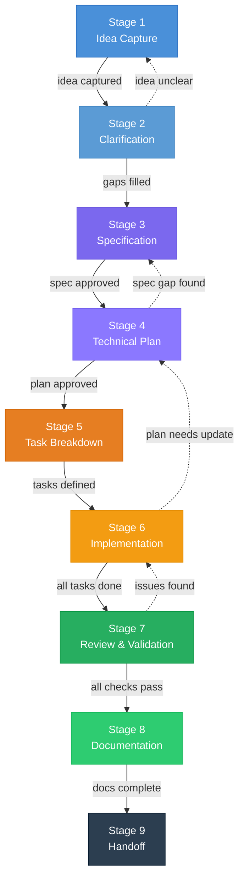

# Workflow Overview

The AI Build OS uses a 9-stage lifecycle to take a project from raw idea to completed, documented, and handed-off deliverable.

Each stage has a defined purpose, required inputs, key questions, expected outputs, exit criteria, and a clear next step.

---

## Lifecycle Diagram

---

## When to Go Back a Stage

The workflow is not strictly linear. Sometimes you must go back to fix something upstream before continuing. **This is normal and expected — it is better to go back than to build on a weak foundation.**

### The rule

> **If you discover a problem, fix it at the stage where it originated, not at the stage where you found it.**

### When to go back — decision table

| You're In | Problem Discovered | Go Back To | What To Do |
|---|---|---|---|
| **Clarification** | The original idea is too vague to clarify | **Stage 1 — Idea Capture** | Rewrite `01-idea.md` with a clearer vision, then return |
| **Specification** | Requirements are still ambiguous after clarification | **Stage 2 — Clarification** | Reopen `02-clarification.md`, answer the new questions |
| **Technical Plan** | A gap or contradiction in the spec is found | **Stage 3 — Specification** | Update `03-spec.md` to fix the gap, get re-approval, then return |
| **Task Breakdown** | The plan doesn't cover a required area | **Stage 4 — Technical Plan** | Update `04-plan.md`, get re-approval, then return |
| **Implementation** | Scope has changed or new requirements emerged | **Stage 3 — Specification** | Update `03-spec.md` and `04-plan.md`, get re-approval for both |
| **Implementation** | The plan needs a different approach | **Stage 4 — Technical Plan** | Update `04-plan.md`, get re-approval, then return |
| **Implementation** | Tasks are wrong, missing, or poorly scoped | **Stage 5 — Task Breakdown** | Update `05-tasks.md`, then return |
| **Review** | Issues found in the implementation | **Stage 6 — Implementation** | Create fix tasks in `05-tasks.md`, fix them, then return to review |
| **Review** | The spec itself was wrong | **Stage 3 — Specification** | Update `03-spec.md`, cascade updates through plan and tasks |
| **Any stage** | New constraints appear (tech, business, regulatory) | **The upstream stage that is affected** | Update the relevant artifact first, then cascade forward |

### Procedure for going back

1. **Note why** you're going back — record it in `STATUS.md` (Open Questions or Notes)
2. **Update the upstream artifact** — fix the problem at its source
3. **Cascade forward** — check whether downstream artifacts need updating too (e.g., a spec change may require a plan update, which may require task updates)
4. **Get re-approval** if the changed artifact was at an approval gate (Stage 3 or Stage 4)
5. **Update STATUS.md** to reflect the current stage
6. **Log the decision** — add an entry to `decisions.md` explaining why the change was made

### The upstream-first principle

Never patch around a problem at a later stage. If the spec is wrong, don't hack around it in code — fix the spec, update the plan, adjust the tasks, then implement correctly. It takes more steps but produces better results and a clearer audit trail.

## Stage Quick Reference

| # | Stage | Purpose | Template | Output |
|---|---|---|---|---|
| 1 | [Idea Capture](01-idea-capture.md) | Record the raw idea | `idea-intake.md` | `01-idea.md` |
| 2 | [Clarification](02-clarification.md) | Fill knowledge gaps | `clarification.md` | `02-clarification.md` |
| 3 | [Specification](03-specification.md) | Define what to build | `spec.md` | `03-spec.md` |
| 4 | [Technical Plan](04-technical-plan.md) | Design how to build it | `implementation-plan.md` | `04-plan.md` |
| 5 | [Task Breakdown](05-task-breakdown.md) | Create ordered task list | `task.md` | `05-tasks.md` |
| 6 | [Implementation](06-implementation.md) | Build it | `implementation-log-entry.md` | `06-implementation-log.md` |
| 7 | [Review](07-review.md) | Verify correctness | `review-checklist.md` | `07-review.md` |
| 8 | [Documentation](08-documentation.md) | Record outcomes | `post-task-report.md` | `08-report.md` |
| 9 | [Handoff](09-handoff.md) | Prepare for what's next | `session-handoff.md` | `09-handoff.md` |

---

## Who Does What

| Action | Typically Done By |
|---|---|
| Capture the idea | Human |
| Ask clarifying questions | Agent or human |
| Write the spec | Agent (with human review) |
| Write the technical plan | Agent (with human approval) |
| Break down tasks | Agent |
| Implement tasks | Agent |
| Review and validate | Agent + human |
| Write documentation | Agent |
| Create handoff notes | Agent |
| Approve stage transitions | Human |

---

## The STATUS.md Contract

Every project has a `STATUS.md` file that tracks:

- **Current stage** — which of the 9 stages the project is in
- **Status** — `not-started`, `in-progress`, `blocked`, or `complete`
- **Current action** — what needs to happen right now
- **Who acts next** — `human`, `agent`, or `both`
- **Artifact due** — which template output is expected
- **Blockers** — what's preventing progress
- **Completed artifacts** — checklist of what exists

See [`project-starter/STATUS.md`](../project-starter/STATUS.md) for the template.
